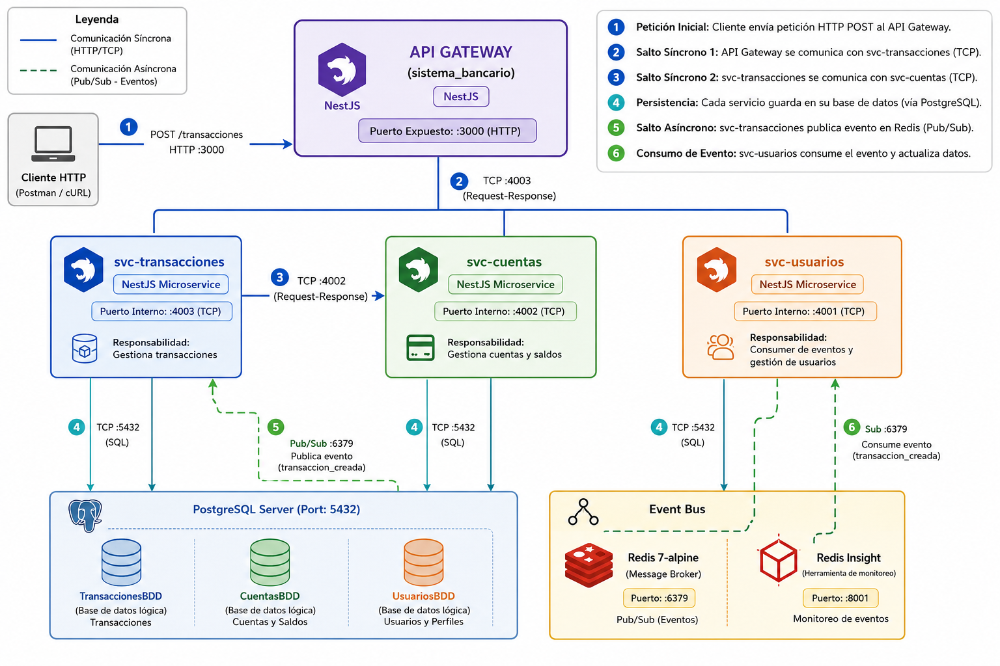

# <<EMM Bank System>>

> MVP de arquitectura de microservicios · <<Materia>> · 7.° semestre · Entrega por avances.

## 👥 Equipo
| Integrante | Rol | GitHub |
|---|---|---|
| Mateo Medranda | <<Backend / Arquitectura>> | @MateoMedranda |
| Erick Obando | <<Transportes / gRPC>> | @usuario |
| Moises Benalcázar | <<Seguridad / Observabilidad>> | @usuario |
| Todos los miembros | <<Documentación / QA>> | @usuario |

## 🧩 Descripción del MVP
✍️ Este sistema consiste en el diseño e implementación del núcleo transaccional básico para una plataforma bancaria distribuida ("Core Bancario"). El dominio se mantiene intencionalmente sencillo para focalizar el esfuerzo en la arquitectura de comunicación síncrona y asíncrona, el manejo de la latencia y el desacoplamiento, el sistema permitirá manejar diferentes roles como un administrador, auditor, cajero y socio o cliente, se manejará un proceso transaccional para depósitos, retiros y transferencias, así como el manejo de diferentes cuentas bancarias, es un proceso sencillo con 3 microservicios, donde existirá una comunicación entre transacciones y cuentas para poder validar cuentas existentes y activas.

Además el sistema contará con una base de datos en PostgreSQL, que puede conectarse de forma local, pero para levantamiento del entorno en producción, se tendrá una base levantada en Render, también con Redis se podrá manejar el control de eventos transaccionales para el funcionamiento asíncrono.

- **MS 1 — Usuarios:** Este microservicio gestiona usuarios (clientes, cajeros, auditores, administradores), autenticación, auditoría y configuración general. 
- **MS 2 — Cuentas:** Este microservicio se encarga de crear, consultar y administrar el estado de las cuentas bancarias (ahorros o corriente). 
- **MS 3 — Transacciones:** Este microservicio gestiona los movimientos de dinero (depósitos, retiros y transferencias). 
- **API Gateway:** punto único de entrada.

## 🛠️ Stack
- **Framework:** NestJS
- **Síncrono:** TCP · **Eventos:** Redis · **2.º transporte:** RabbitMQ/MQTT/NATS · **Contrato:** gRPC
- **Seguridad:** JWT + Guard · **Observabilidad:** Sentry
- **BD:** PostgreSQL · **Contenedores:** Docker Compose · **Estructura:** monorepo

## ▶️ Cómo ejecutar

docker compose ps

curl http://localhost:3000/api/<<recurso>>

## 🏗️ Arquitectura
✍️ Diagrama de arquitectura

## 🧭 Metodología
- **Kanban:** [Kanban Sistema Bancario](https://github.com/users/MateoMedranda/projects/3/views/1) (captura en /docs).
- **Ramificación:** <<GitHub Flow>> — `main` protegida, ramas `feat/…`, PRs revisados, tags por avance.
- **Commits semánticos:** Conventional Commits.

## 🗺️ Patrones y principios aplicados
✍️ <<Nómbrenlos: API Gateway, Proxy, Publisher/Subscriber, DIP, DTO+Pipes (SRP), Exception Filters. Cuáles trae Nest y cuáles agregaron ustedes.>>

---

## 🟢 Avance 1 — Acoplamiento temporal y latencia · `tag v1-avance1`
### Caminos
- **Síncrono (TCP):** Gateway → <<A>> → <<B>>.
- **Asíncrono (Redis):** Gateway publica evento; el consumidor procesa sin bloquear.

### 📈 Latencia (con `benchmark.js`)
| Camino | Promedio (ms) | p95 (ms) | Máx (ms) |
|---|---|---|---|
| Síncrono | << >> | << >> | << >> |
| Asíncrono | << >> | << >> | << >> |

### 🧨 Acoplamiento temporal
✍️ <<Al apagar <<B>>, la petición síncrona falla; el flujo asíncrono acepta la petición sin bloquearse (capturas).>>

### 🧠 Análisis
✍️ <<Por qué se suman las latencias y qué es el acoplamiento temporal según lo observado.>>

---

## 🟡 Avance 2 — Comunicación: gRPC + 2.º transporte + excepciones · `tag v2-avance2`
### gRPC (contrato + monorepo)
✍️ <<Contrato `.proto` y comunicación gRPC entre <<A>> y <<B>>. Control de errores con try/catch.>>

### Segundo transporte
✍️ <<Transporte elegido (<<RabbitMQ/MQTT/NATS>>) y flujo PUB/SUB o queue implementado.>>

### 🔁 Comparación de transportes
| Transporte | Tipo | Patrón | Uso en el proyecto |
|---|---|---|---|
| TCP | Síncrono | Petición-respuesta | << >> |
| Redis | Asíncrono | PUB/SUB | << >> |
| <<RabbitMQ/MQTT/NATS>> | Asíncrono | <<PUB/SUB o queue>> | << >> |
| gRPC | Síncrono | Contrato/RPC | << >> |

✍️ <<1 párrafo: cuándo conviene cada uno.>>

### 🧯 Manejo de excepciones
✍️ <<Qué errores se controlan y cómo (evidencia de un error que no tumba el servicio).>>

---

## 🔵 Avance 3 — Seguridad, observabilidad e integración (FINAL) · `tag v3-final`
### 🔐 Autenticación y autorización
✍️ <<Login que emite JWT; Guard que protege rutas. Evidencia: 200 con token, 401 sin token (y 403 por rol si aplica).>>

### 📊 Observabilidad (Sentry)
✍️ <<Qué se registra; captura del error en el panel de Sentry.>>

### 🔗 Integración final
✍️ <<Operación que atraviesa varios microservicios/transportes desde el Gateway.>>

### 🏗️ Diagrama final
✍️ <<Sistema integrado>>

---

## 🎤 Defensa
✍️ <<Enlace a diapositivas + guion. Runbook de la demo (levantar → login → ruta protegida → operación integrada → error en Sentry). Preguntas frecuentes preparadas.>>

## 🏷️ Tags de entrega
- `v1-avance1` — <<fecha>> · `v2-avance2` — <<fecha>> · `v3-final` — <<fecha>>
