# EMM Bank System

> MVP de arquitectura de microservicios · Aplicaciones Distribuidas · 7.° semestre · Entrega por avances.

## 👥 Equipo
| Integrante | Rol | GitHub |
|---|---|---|
| Mateo Medranda | <<Backend / Arquitectura>> | @MateoMedranda |
| Erick Obando | <<Transportes / gRPC>> | @usuario |
| Moises Benalcázar | <<Seguridad / Observabilidad>> | @usuario |
| Todos los miembros | <<Documentación / QA>> | @usuario |

## 🧩 Descripción del MVP
✍️ Este sistema consiste en el diseño e implementación del núcleo transaccional básico para una plataforma bancaria distribuida ("Core Bancario"). El dominio se mantiene intencionalmente sencillo para focalizar el esfuerzo en la arquitectura de comunicación síncrona y asíncrona, el manejo de la latencia y el desacoplamiento, el sistema permitirá manejar diferentes roles como un administrador, auditor, cajero y socio o cliente, se manejará un proceso transaccional para depósitos, retiros y transferencias, así como el manejo de diferentes cuentas bancarias, es un proceso sencillo con 3 microservicios, donde existirá una comunicación entre transacciones y cuentas para poder validar cuentas existentes y activas.

Además el sistema contará con una base de datos en PostgreSQL, que puede conectarse de forma local, pero para levantamiento del entorno en producción, se tendrá una base levantada en Render, también con Redis se podrá manejar el control de eventos transaccionales para el funcionamiento asíncrono.

- **MS 1 — Usuarios:** Este microservicio gestiona usuarios (clientes, cajeros, auditores, administradores), autenticación, auditoría y configuración general. 
- **MS 2 — Cuentas:** Este microservicio se encarga de crear, consultar y administrar el estado de las cuentas bancarias (ahorros o corriente). 
- **MS 3 — Transacciones:** Este microservicio gestiona los movimientos de dinero (depósitos, retiros y transferencias). 
- **API Gateway:** punto único de entrada.

## 🛠️ Stack
- **Framework:** NestJS
- **Síncrono:** TCP · **Eventos:** Redis · **2.º transporte:** RabbitMQ/MQTT/NATS · **Contrato:** gRPC
- **Seguridad:** JWT + Guard · **Observabilidad:** Sentry
- **BD:** PostgreSQL · **Contenedores:** Docker Compose · **Estructura:** monorepo

## ▶️ Cómo ejecutar
1. Clonar el repositorio y configurar las variables de entorno basándose en el archivo `.env.example` (asegúrate de que el archivo `.env` quede en la raíz del proyecto).
2. Dado que el `docker-compose.yml` se encuentra dentro de la carpeta de la tarea y el `.env` en la raíz, debes usar el siguiente comando para levantar toda la infraestructura:
```bash
cd tarea-1
docker compose --env-file ../.env up -d --build
```
3. Para verificar que los contenedores están corriendo o ver los logs:
```bash
docker compose ps
docker compose logs -f
```
4. Para probar el sistema (Healthcheck del API Gateway):
```bash
curl http://localhost:3000/api/health
```

## 🏗️ Arquitectura
✍️ Diagrama de arquitectura
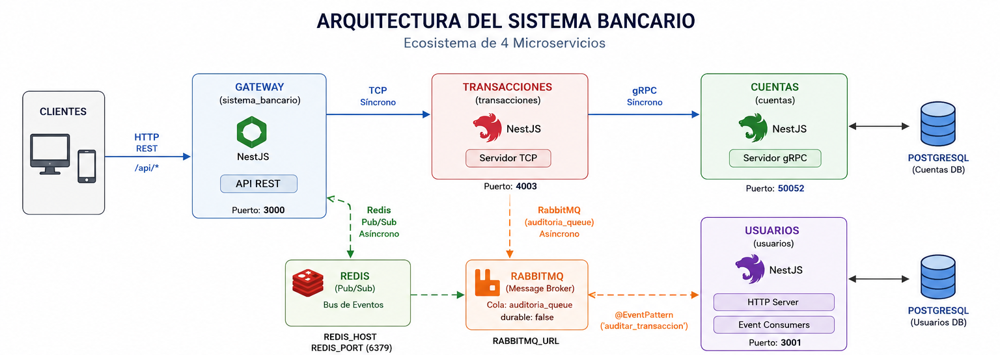

## 🧭 Metodología
- **Kanban:** Gestionamos las tareas usando GitHub Projects mediante un flujo de estados (Backlog, Por Hacer, En Progreso, En Revisión, Hecho) para hacer trazable el progreso.
  - 🔗 [Enlace al Tablero Kanban](https://github.com/users/MateoMedranda/projects/3/views/1)
  - <details><summary>📸 Ver captura del tablero</summary>
    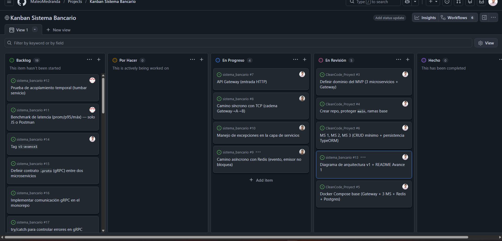
    </details>

- **Ramificación (GitHub Flow):** Mantenemos la rama `main` protegida. Toda integración requiere aprobación obligatoria mediante *Pull Requests*. El desarrollo se realiza en ramas efímeras descriptivas y cada hito se congela usando **tags** (ej. `v1-avance1`).
  - <details><summary>📸 Ver evidencia de protección de la rama</summary>
    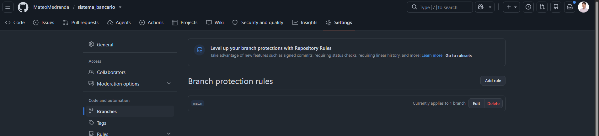
    </details>

- **Commits Semánticos (Conventional Commits):** Usamos el formato `tipo(alcance): descripción` para mantener el historial del proyecto limpio y legible. Ejemplos reales de nuestro trabajo:
  - `feat(docker): agregar Dockerfiles para microservicios`
  - `fix(usuarios): corregir modulo faltante en produccion`
  - `docs(readme): agregar diagrama de arquitectura y kanban`

## 🗺️ Patrones y principios aplicados
- **API Gateway Pattern:** Para tener un único punto de entrada unificado y enrutar las peticiones.
- **Publisher/Subscriber (Event-Driven):** A través de Redis para aislar servicios no críticos (como notificaciones de usuarios).
- **Request-Response (TCP):** Para procesos transaccionales que requieren validación inmediata.
- **Single Responsibility Principle (SOLID - SRP):** Cada microservicio maneja su propia base de datos (aislamiento de datos) y sus propios DTOs.
- **Exception Filters:** Uso de bloques `try-catch` y filtros globales en NestJS para centralizar el manejo de errores.

---

## 🟢 Avance 1 — Acoplamiento temporal y latencia · `tag v1-avance1`

### Caminos

Durante la prueba se analizaron dos flujos de comunicación dentro del sistema:

- **Síncrono (TCP):** Gateway → Microservicio Transacciones → Microservicio Cuentas.
  
  El Gateway realiza una petición directa mediante TCP y espera la respuesta del servicio dependiente antes de responder al cliente.

- **Asíncrono (Redis):** Gateway → Redis → Microservicio Usuarios.

  El Gateway publica un evento en Redis y responde inmediatamente sin esperar que el consumidor procese el mensaje.

### 📈 Latencia (con `benchmark.js`)

Se utilizó el script `benchmark.js` para ejecutar múltiples peticiones POST contra ambos flujos y medir la latencia promedio, percentil 95 (p95) y tiempo máximo de respuesta.

| Camino | Promedio (ms) | p95 (ms) | Máx (ms) |
|---|---:|---:|---:|
| TCP (Transacciones) | 4.59 | 6 | 73 |
| Redis (Usuarios) | 2.69 | 3 | 73 |

### 🧨 Acoplamiento temporal

Se realizó una prueba deteniendo el microservicio Cuentas, encargado del segundo salto de la cadena síncrona.

Inicialmente, con todos los servicios activos, el endpoint `/api/transacciones` respondió correctamente con código HTTP **201 Created**, demostrando que el flujo síncrono funcionaba cuando todas las dependencias estaban disponibles.

Posteriormente, se detuvo el microservicio Cuentas mediante Docker Compose. Al enviar nuevamente una petición al endpoint `/api/transacciones`, el Gateway no pudo completar la comunicación TCP con el microservicio caído, generando un error HTTP **500 Internal Server Error** debido a la dependencia temporal existente entre los servicios.

En contraste, el endpoint `/api/usuarios/evento` continuó respondiendo correctamente con código HTTP **200 OK**, incluso con el consumidor detenido, debido a que el Gateway únicamente publica el evento en Redis y no espera una respuesta inmediata del microservicio Usuarios.

Esto demuestra que el modelo basado en eventos desacopla temporalmente al productor y al consumidor, permitiendo que el sistema continúe aceptando solicitudes aunque el consumidor no se encuentre disponible en ese momento.

### Evidencias

#### Flujo TCP funcionando (HTTP 201 Created)

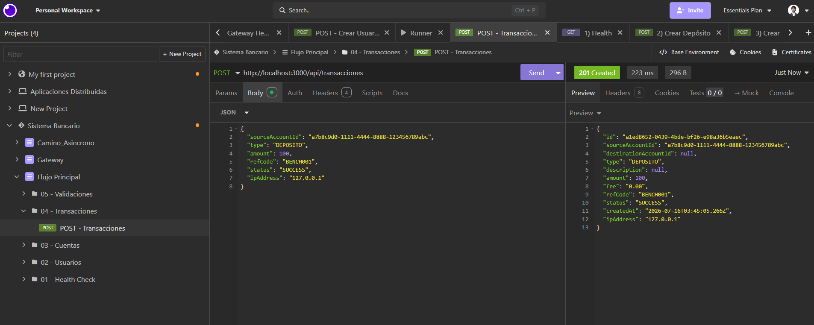

#### Flujo Redis funcionando (HTTP 200 OK)

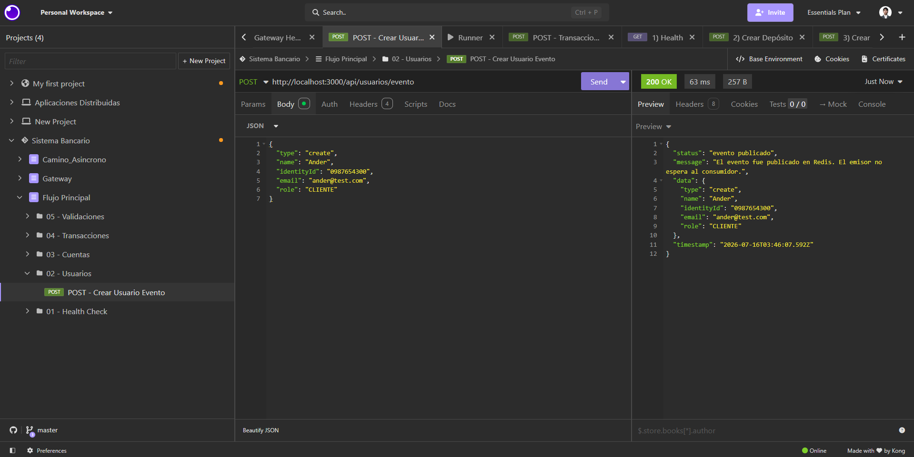

#### TCP con microservicio Cuentas detenido (HTTP 500 Internal Server Error)

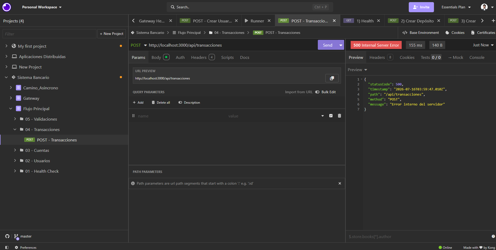

#### Redis con consumidor detenido (HTTP 200 OK)

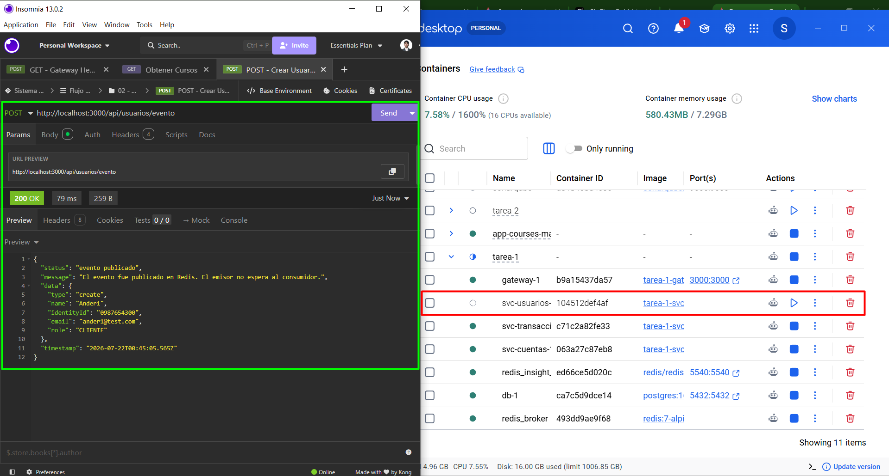

### 🧠 Análisis

El flujo síncrono presentó mayor latencia debido a que la solicitud atraviesa una cadena de microservicios mediante TCP, acumulando el tiempo de procesamiento y comunicación en cada salto.

Cada servicio debe completar su operación antes de devolver la respuesta al cliente, por lo que una falla o demora en uno de los servicios dependientes afecta directamente al flujo completo.

En contraste, el flujo asíncrono mediante Redis reduce la latencia percibida porque el Gateway únicamente publica un evento y responde sin esperar el procesamiento del consumidor.

Este comportamiento evidencia el concepto de acoplamiento temporal: en una comunicación síncrona los servicios deben estar disponibles simultáneamente para completar una operación, mientras que en un modelo basado en eventos el productor y consumidor pueden operar de forma independiente.


---

## 🟡 Avance 2 — Comunicación: gRPC + 2.º transporte + excepciones · `tag v2-avance2`
### gRPC (contrato + monorepo)
El microservicio de Transacciones consume el contrato definido en `proto/cuentas.proto` a través de `CUENTAS_SERVICE`, usando gRPC para validar cuentas antes de registrar una transacción. La comunicación se adapta al patrón monorepo NestJS con `ClientsModule.registerAsync`, donde `protoPath` apunta al contrato y la URL del servicio se resuelve mediante variables de entorno.

### Segundo transporte
Se incorporó RabbitMQ como segundo transporte asincrónico con cola `auditoria_queue`. En el flujo implementado, Transacciones publica el evento `auditar_transaccion` y Usuarios lo consume en un `EventPattern` de RabbitMQ, manteniendo el transporte Redis ya usado para eventos de usuario.

### 🔁 Comparación de transportes
| Transporte | Tipo | Patrón | Uso en el proyecto |
|---|---|---|---|
| TCP | Síncrono | Petición-respuesta | Comunicación principal entre Gateway y Transacciones |
| Redis | Asíncrono | PUB/SUB | Consumidor de eventos de usuario en Usuarios |
| RabbitMQ | Asíncrono | Queue / PUB-SUB | Cola `auditoria_queue` para auditoría de transacciones |
| gRPC | Síncrono | Contrato/RPC | Validación de cuentas entre Transacciones y Cuentas |

En el sistema bancario, TCP y gRPC se usan para operaciones que requieren respuesta inmediata y contrato explícito, mientras que Redis y RabbitMQ se usan para desacoplar procesos en segundo plano y evitar bloquear al emisor.

### 🧯 Manejo de excepciones
La llamada a `validateCuenta` en el servicio de Transacciones se encapsuló con `lastValueFrom` y `try/catch` para convertir una falla de comunicación o una cuenta inexistente en una respuesta controlada del servicio, sin derrumbar el proceso. El resultado esperado en la capa de negocio es una `NotFoundException` clara para el cliente, en lugar de una excepción no manejada que corte el microservicio.

### 📸 Evidencias de Avance 2

- Health del Gateway:
  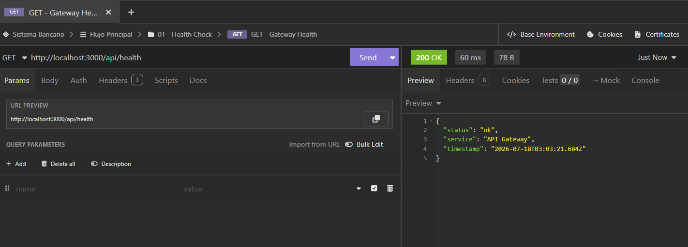

- Transacción válida vía HTTP al Gateway:
  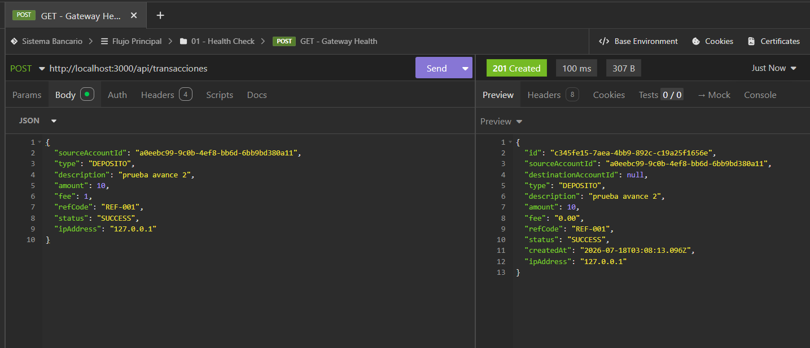

- Error controlado cuando la cuenta no existe:
  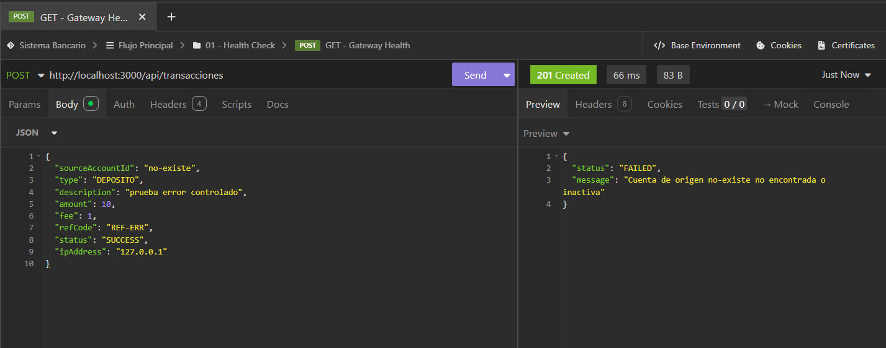

- Logs del consumidor RabbitMQ en Usuarios:
  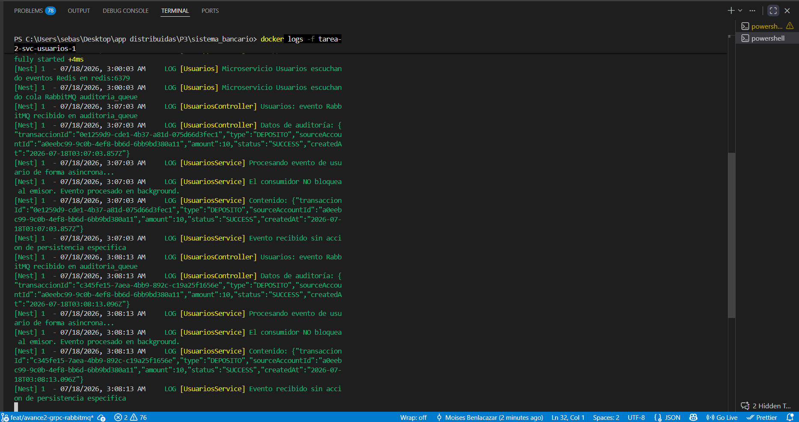

---

## 🔵 Avance 3 — Seguridad, observabilidad e integración (FINAL) · `tag v3-final`
### 🔐 Autenticación y autorización
✍️ <<Login que emite JWT; Guard que protege rutas. Evidencia: 200 con token, 401 sin token (y 403 por rol si aplica).>>

### 📊 Observabilidad (Sentry)
✍️ <<Qué se registra; captura del error en el panel de Sentry.>>

### 🔗 Integración final
✍️ <<Operación que atraviesa varios microservicios/transportes desde el Gateway.>>

### 🏗️ Diagrama final
✍️ <<Sistema integrado>>

---

## 🎤 Defensa
✍️ <<Enlace a diapositivas + guion. Runbook de la demo (levantar → login → ruta protegida → operación integrada → error en Sentry). Preguntas frecuentes preparadas.>>

## 🏷️ Tags de entrega
- `v1-avance1` — <<fecha>> · `v2-avance2` — <<fecha>> · `v3-final` — <<fecha>>
