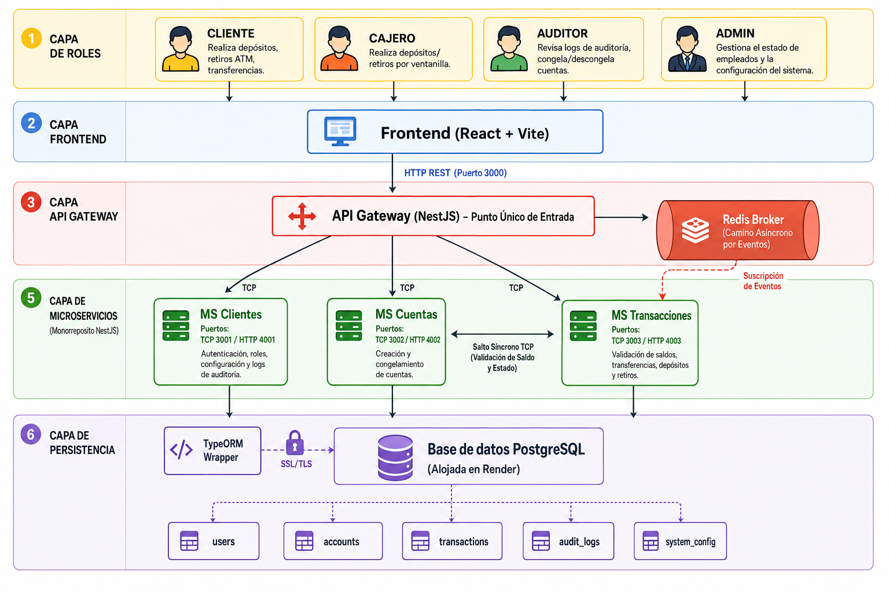
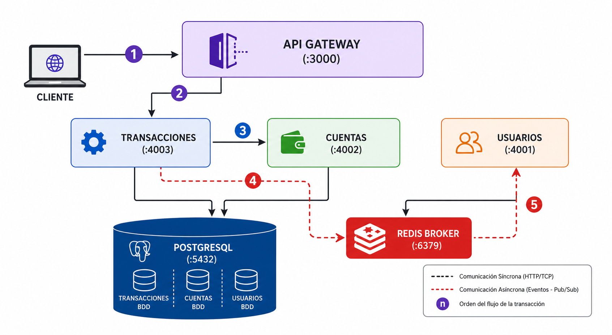
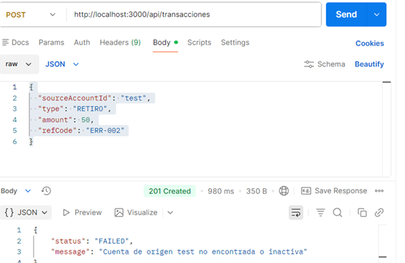

# Documentación — Tarea 1 (Avance 1)

Esta carpeta de documentación contiene las evidencias visuales y técnicas correspondientes al **Avance 1** del proyecto (Medición del acoplamiento temporal y acumulación de latencia).

---

## 1. Descripción del Dominio
El sistema implementa el núcleo de un "Core Bancario" distribuido. El dominio se ha mantenido intencionalmente sencillo para enfocarnos en la arquitectura de comunicación. Está compuesto por:
- **API Gateway (`sistema_bancario`):** Orquestador principal y punto único de entrada HTTP (REST). No tiene lógica de negocio propia.
- **Microservicio Transacciones (`svc-transacciones`):** Inicia la lógica central. Gestiona el registro de movimientos y delega tareas a otros servicios.
- **Microservicio Cuentas (`svc-cuentas`):** Administra los saldos. Se comunica de forma estricta (síncrona) para asegurar la consistencia.
- **Microservicio Usuarios (`svc-usuarios`):** Consumidor de eventos (notificaciones/historial). Opera de forma paralela sin afectar el tiempo de respuesta principal.

---

## 2. Diagrama de Arquitectura y Flujos

### Avance 1: MVP Síncrono vs Asíncrono


### Avance 2: Integración con gRPC y Segundo Transporte


### Avance 3: Sistema Final Integrado (Seguridad y Observabilidad)


### Avance 4: Arquitectura Final (Versión 4)


*Arriba se muestran los diagramas de evolución de nuestra arquitectura de microservicios. A continuación explicamos los dos caminos fundamentales (evidenciados desde la V1):*

### Camino Síncrono (Acoplamiento Fuerte)
Está representado por las flechas de color sólido **(TCP Req/Res)**. 
- El Gateway recibe la petición HTTP y hace una llamada TCP a **Transacciones**.
- **Transacciones** se queda bloqueado esperando que **Cuentas** (vía TCP) le confirme el saldo y realice el débito.
- *Problema:* El tiempo total es la suma de los tiempos de los 3 componentes. Si **Cuentas** falla o está lento, el Gateway completo le falla al cliente. (Acoplamiento temporal).

### Camino Asíncrono (Desacoplamiento)
Representado por las flechas punteadas **(Pub/Sub Event)**.
- Una vez finalizada la parte crítica, **Transacciones** emite un evento hacia **Redis Broker** y da por terminada su tarea (Fire and Forget).
- **Usuarios** (conectado a Redis) toma este evento cuando tiene recursos y lo procesa.
- *Ventaja:* El Gateway responde al cliente mucho más rápido, y si el servicio de **Usuarios** se cae, el sistema de transacciones sigue funcionando sin problemas.

---

## 3. Patrones y Principios Aplicados
A lo largo de este primer avance, aplicamos:
- **API Gateway Pattern:** Para tener un único punto de entrada unificado y enrutar las peticiones.
- **Publisher/Subscriber (Event-Driven):** A través de Redis para aislar servicios no críticos (como notificaciones de usuarios).
- **Request-Response (TCP):** Para procesos transaccionales que requieren validación inmediata.
- **Single Responsibility Principle (SOLID - SRP):** Cada microservicio maneja su propia base de datos (aislamiento de datos) y sus propios DTOs.
- **Exception Filters:** Uso de bloques `try-catch` y filtros globales en NestJS para centralizar el manejo de errores.

---

## 4. Medición de Latencia y Acoplamiento Temporal

*(Ejecuta tu script `benchmark.js` y reemplaza estos valores con tus resultados reales)*

| Ruta | Transporte | Promedio (ms) | P95 (ms) | Máx (ms) |
|---|---|---|---|---|
| `POST /transacciones` | TCP (Síncrono) | *...* | *...* | *...* |
| `POST /usuarios/evento`| Redis (Asíncrono)| *...* | *...* | *...* |

### Análisis de Resultados
- **Acumulación de latencia:** En la ruta de transacciones se observa una latencia mayor porque el Gateway debe esperar a que el MS de Transacciones termine de procesar, y este a su vez espera al MS de Cuentas, sumando los tiempos de red y procesamiento de los 3 nodos. En contraste, la ruta asíncrona por Redis responde de inmediato tras encolar el mensaje.
- **Acoplamiento temporal:** Durante las pruebas, apagamos manualmente el contenedor de `svc-cuentas`. Como resultado, toda la petición de transacciones falló (Timeout / Connection Refused), evidenciando el acoplamiento. Sin embargo, al apagar `svc-usuarios`, el flujo asíncrono de publicación de eventos siguió funcionando sin retornar errores al cliente.

---

## 5. Gestión del Proyecto (Kanban)


- **Enlace al Tablero Kanban:** [Inserta el enlace aquí]

El trabajo se gestiona en tarjetas movibles a través de estados: Backlog, Por Hacer, En Progreso, En Revisión y Terminado.

---

## 6. Estrategia de Ramificación y Commits Semánticos


*La imagen superior evidencia la configuración de nuestro repositorio aplicando GitHub Flow.*

Nuestra estrategia principal es **GitHub Flow**:
- La rama `main` está protegida (como se ve en la captura), requiriendo *Pull Requests (PR)* obligatorios y revisión antes de mezclar código.
- Se crean ramas descriptivas para cada tarea: `feat/config-docker`, `fix/latencia-tcp`, etc.

### Commits Semánticos (Conventional Commits)
Hemos utilizado un historial limpio para entender los cambios del equipo, por ejemplo:
- `feat(docker): agregar Dockerfiles para microservicios y gateway`
- `fix(usuarios): cambiar mapped-types a dependencias para produccion`
- `docs(readme): agregar documentacion y analisis del avance 1`

---

# Documentación — Tarea 2 (Avance 2)

Evidencia de errores controlados sin caída del servidor y tabla comparativa de transportes.

**Autor:** Erick Obando | **Rama:** feat/evidencia-error | **Fecha:** 2026-07-17

---

## 1. Manejo de excepciones — Demo de errores sin caída

### Prueba A: Cuenta inexistente (error controlado)



- **Request:** `POST /api/transacciones` con `sourceAccountId` inexistente
- **Resultado:** El servicio retorna un error controlado (`{ status: 'FAILED', message: '...' }`) sin caerse
- **Análisis:** La llamada gRPC a Cuentas falla, el `try/catch` en `validarCuentaGrpc()` captura la excepción y retorna un objeto con status FAILED en vez de propagar la excepción. El microservicio sigue funcionando.

### Prueba B: Health check después del error


- **Request:** `GET /api/health`
- **Resultado:** `200 OK` — Gateway sigue vivo
- **Análisis:** Después de un error en la cadena gRPC, el Gateway y todos los microservicios siguen operativos. El `AllExceptionsFilter` global captura cualquier excepción no manejada y retorna una respuesta HTTP estructurada.

### Prueba C: Transacción exitosa (flujo normal)


- **Request:** `POST /api/transacciones` con datos válidos
- **Resultado:** `201 Created` — transacción registrada
- **Análisis:** La cadena completa funciona: Gateway → TCP → Transacciones → gRPC → Cuentas. La transacción se guarda en la BD y se publica el evento de auditoría a RabbitMQ.

### Flujo de excepciones

```
HTTP Client → Gateway (AllExceptionsFilter captura todo)
            → ValidationPipe (rechaza DTO inválido)
            → TCP → Transacciones
            → gRPC → Cuentas (validarCuentaGrpc con try/catch)
            → Si falla: retorna { status: 'FAILED', message: '...' }
            → Si falla gRPC: try/catch retorna null, servicio continúa
```

| Excepción | Origen | Cómo se maneja |
|---|---|---|
| `NotFoundException` | Cuentas (cuenta no existe/inactiva) | Se lanza en `CuentasService.validate()`, se propaga por gRPC |
| `try/catch` en `validarCuentaGrpc` | Transacciones | Captura error gRPC y retorna `null` en vez de exception |
| `ValidationPipe` | Gateway | Rechaza requests con DTO inválido antes del controlador |
| `AllExceptionsFilter` | Gateway | Captura todas las excepciones y retorna JSON estructurado |

---

## 2. Segundo transporte — RabbitMQ

### Evidencia de consumo


- **Cola:** `auditoria_queue`
- **Publisher:** Transacciones emite evento `auditar_transaccion` después de crear una transacción
- **Consumer:** Usuarios consume el evento via `@EventPattern('auditar_transaccion')`
- **Análisis:** RabbitMQ funciona como segundo canal asíncrono, desacoplando la auditoría del flujo principal. Si Usuarios se cae, la transacción igual se registra.

---

## 3. Tabla comparativa de transportes

| Transporte | Tipo | Patrón | Cuándo lo usaron |
|---|---|---|---|
| TCP | Síncrono | Petición-respuesta | Gateway → Transacciones (cadena síncrona, primer salto) |
| gRPC | Síncrono | Contrato/RPC | Transacciones → Cuentas (validar cuenta con contrato `.proto`) |
| Redis | Asíncrono | PUB/SUB | Gateway → Usuarios (eventos de usuario, fire-and-forget) |
| RabbitMQ | Asíncrono | Queue / PUB-SUB | Transacciones → Usuarios (auditoría vía `auditoria_queue`) |

### Análisis: ¿Cuándo conviene cada transporte?

**TCP** conviene cuando se necesita respuesta inmediata en una cadena de servicios, como el Gateway delegando a Transacciones. Sin embargo, tiene acoplamiento temporal: si un eslabón falla, toda la cadena falla.

**gRPC** es preferible sobre TCP cuando se requiere un contrato formal (`.proto`) que documenta tipos y métodos disponibles, facilitando la interoperabilidad y el mantenimiento. Además, el manejo de errores es más preciso gracias a los status codes definidos en el contrato.

**Redis** conviene para eventos asíncronos que no bloquean al emisor. El Gateway publica un evento y no espera respuesta, lo que permite que el sistema siga funcionando aunque el consumidor (Usuarios) esté temporalmente caído.

**RabbitMQ** conviene cuando se necesita persistencia de mensajes y routing más sofisticado que PUB/SUB simple. En nuestro caso, la cola `auditoria_queue` garantiza que los eventos de auditoría se procesen aunque el consumidor no esté disponible inmediatamente, a diferencia de Redis que pierde mensajes si el subscriber no está conectado.
