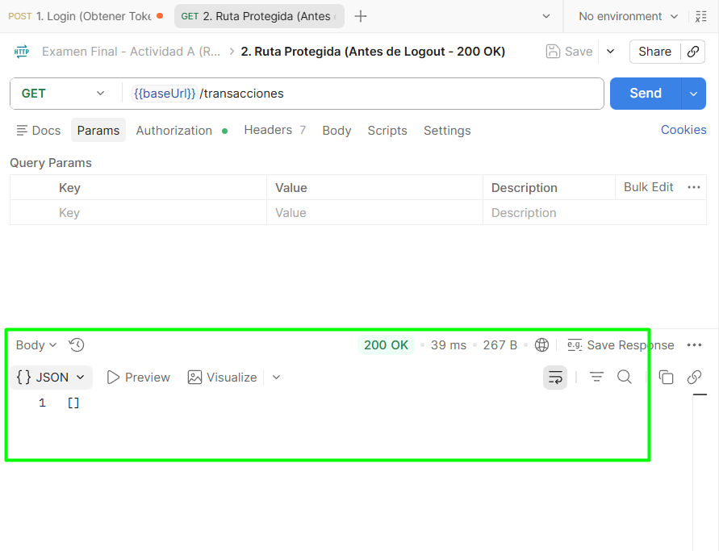
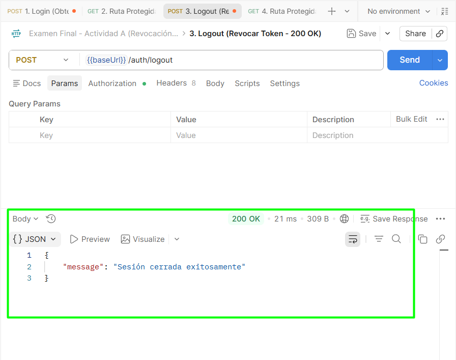
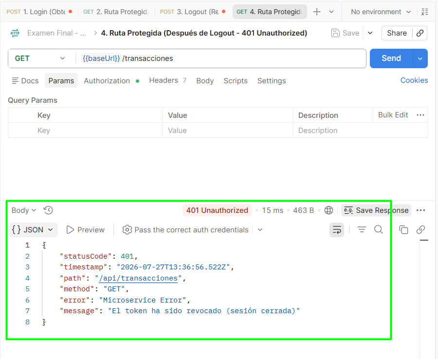

# Bitácora — Examen Final

## 0. Identificación

| | |
|---|---|
| **Nombre** | Moisés Benalcázar |
| **Usuario GitHub** | @SebXpress |
| **Grupo / Proyecto** | Grupo 7 — Sistema Bancario EMM |
| **Actividad asignada** | Actividad A — Revocación de sesión JWT (logout real) |
| **Rama** | `exam/SebXpress` |
| **Tag** | `examen-SebXpress` |
| **Pull Request** | *(enlace al Pull Request en GitHub)* |
| **Tarjeta Kanban** | *(enlace a la tarjeta Kanban)* |
| **¿Hiciste el Paso 0?** | No — la base de JWT ya existía en package.json (@nestjs/jwt) y en el módulo de autenticación |

---

## 1. Qué construí

Implementé el mecanismo de revocación de sesiones JWT ("logout real") mediante una lista negra respaldada en Redis. Al invocar `POST /api/auth/logout`, el identificador único del token (`jti`) se registra en Redis con un TTL dinámico ajustado a la expiración restante del token (`exp`). El `JwtAuthGuard` intercepta las peticiones subsiguientes, consulta Redis y rechaza con `401 Unauthorized` cualquier petición realizada con un token revocado.

---

## 2. Anclaje con el repositorio de mi grupo — obligatorio (C2)

| Código preexistente | Archivo:línea | Cómo me conecto con él |
|---|---|---|
| `JwtAuthGuard` | `apps/sistema_bancario/src/auth/guards/jwt-auth.guard.ts:13` | Extendí el guard para inyectar `TokenBlacklistService` y verificar la revocación en Redis antes de otorgar acceso |
| Generación de `jti` | `apps/sistema_bancario/src/auth/auth.service.ts:85` | Reutilicé el atributo `jti: crypto.randomUUID()` generado en el payload del JWT durante el login |
| Configuración Redis | `apps/sistema_bancario/src/app.module.ts:25` | Reutilicé las variables de entorno `REDIS_HOST` y `REDIS_PORT` configuradas previamente |

**¿Qué convención del repositorio seguí para que mi código no desentone?**
Seguí la estructura modular de NestJS dentro de `apps/sistema_bancario/src/auth/`, la inyección de dependencias nativa, los decoradores `@Public()` preexistentes y el uso de `UnauthorizedException`.

**¿Qué NO dupliqué, pudiendo hacerlo?**
No creé un guard nuevo ni reescribí la lógica de JWT. Extendí directamente el `JwtAuthGuard` registrado globalmente vía `APP_GUARD` en `app.module.ts`.

---

## 3. Decisiones técnicas

### Decisión 1
- **Qué decidí:** Utilizar Redis con expiración dinámica basada en la diferencia entre el tiempo actual y la expiración (`exp - now`).
- **Alternativa que descarté:** Guardar tokens revocados en memoria en proceso (Array/Map).
- **Por qué:** En una arquitectura de API Gateway escalada horizontalmente, la memoria local no se comparte. Redis garantiza invalidación global centralizada.

### Decisión 2
- **Qué decidí:** Estrategia "Falla cerrado" (Fail-Closed) en el guard ante caídas de Redis.
- **Alternativa que descarté:** "Falla abierto" (Fail-Open).
- **Por qué:** En un contexto bancario, la seguridad prevalece sobre la disponibilidad. Ante la imposibilidad de validar la revocación, se deniega la petición.

---

## 4. Las 3 preguntas de mi actividad

**Pregunta 1: ¿Por qué el TTL de la entrada de revocación debe coincidir con la expiración del token, en vez de guardarla para siempre?**
> Para optimizar el uso de memoria en Redis. Una vez transcurrido el tiempo de vida natural del JWT (`exp`), la validación criptográfica estándar lo rechazará automáticamente, haciendo innecesario mantener su `jti` guardado.

**Pregunta 2: Si el almacén de revocados (Redis) está caído cuando llega una petición: ¿tu guard falla abierto (deja pasar) o falla cerrado (rechaza)? ¿Cuál elegiste y qué riesgo aceptas con esa decisión?**
> Falla **cerrado** (`401 Unauthorized`). Acepto el riesgo de denegación de servicio temporal a usuarios válidos si Redis cae, evitando el riesgo crítico de permitir transacciones a tokens potencialmente revocados.

**Pregunta 3: ¿En qué se diferencia esto de simplemente borrar el token en el navegador del cliente?**
> Borrar el token en el cliente es un descarte local. Si el token fue interceptado previamente, un atacante podría seguir utilizándolo desde cURL o Postman. La revocación en Redis invalida la sesión activamente en el servidor para cualquier cliente.

---

## 5. Uso de Inteligencia Artificial — obligatorio

| # | Qué le pedí | Qué me devolvió | Qué corregí, adapté o adapted — y por qué |
|:--:|---|---|---|
| 1 | Estructurar la revocación de tokens JWT en NestJS | Código para guard y servicio Redis | Adapté la inyección directamente en `JwtAuthGuard` preexistente sin crear clases duplicadas |
| 2 | Diseño de la prueba automatizada en Jest | Test unitario con mocks de JwtService y Blacklist | Ajusté el mock del `ExecutionContext` para adaptarse al formato exacto del proyecto |

---

## 6. Evidencia

| Archivo | Qué demuestra |
|---|---|
| `antes-ruta-protegida-200.png` | Acceso exitoso (200 OK) a `/api/transacciones` con token recién emitido |
| `despues-logout-200.png` | Cierre de sesión exitoso (200 OK) registrando el `jti` en Redis mediante `POST /api/auth/logout` |
| `despues-ruta-protegida-401.png` | Rechazo (401 Unauthorized) al intentar reusar el token revocado |

### Capturas de pantalla

#### 1. Ruta protegida antes del Logout (200 OK)

#### 2. Logout exitoso (200 OK)

#### 3. Ruta protegida después del Logout (401 Unauthorized)

---

## 7. Prueba automatizada

| | |
|---|---|
| **Archivo de la prueba** | `apps/sistema_bancario/src/auth/guards/jwt-auth.guard.spec.ts` |
| **Comando para ejecutarla** | `npx jest apps/sistema_bancario/src/auth/guards/jwt-auth.guard.spec.ts` |
| **Qué verifica** | Que el `JwtAuthGuard` permita peticiones con tokens válidos y rechace con `UnauthorizedException` si el `jti` figura como revocado en Redis |
| **¿Falla sin mi cambio?** | Sí, porque antes el guard no consultaba la lista negra en Redis |

---

## 8. Estado final — honesto

**Funciona:**
- Emisión de JWT con `jti`.
- Endpoint `POST /api/auth/logout`.
- Intercepción en `JwtAuthGuard` con falla cerrada y verificación en Redis.
- Pruebas unitarias al 100% en verde.
- Evidencias capturadas y guardadas.

---

## 9. Declaración

> Declaro que este trabajo es individual, que corresponde a la actividad que me fue asignada, y que la sección 5 refleja de forma completa y veraz el uso que hice de herramientas de Inteligencia Artificial durante el examen.

**Nombre:** Moisés Benalcázar
**Fecha:** 27 de julio de 2026
"@